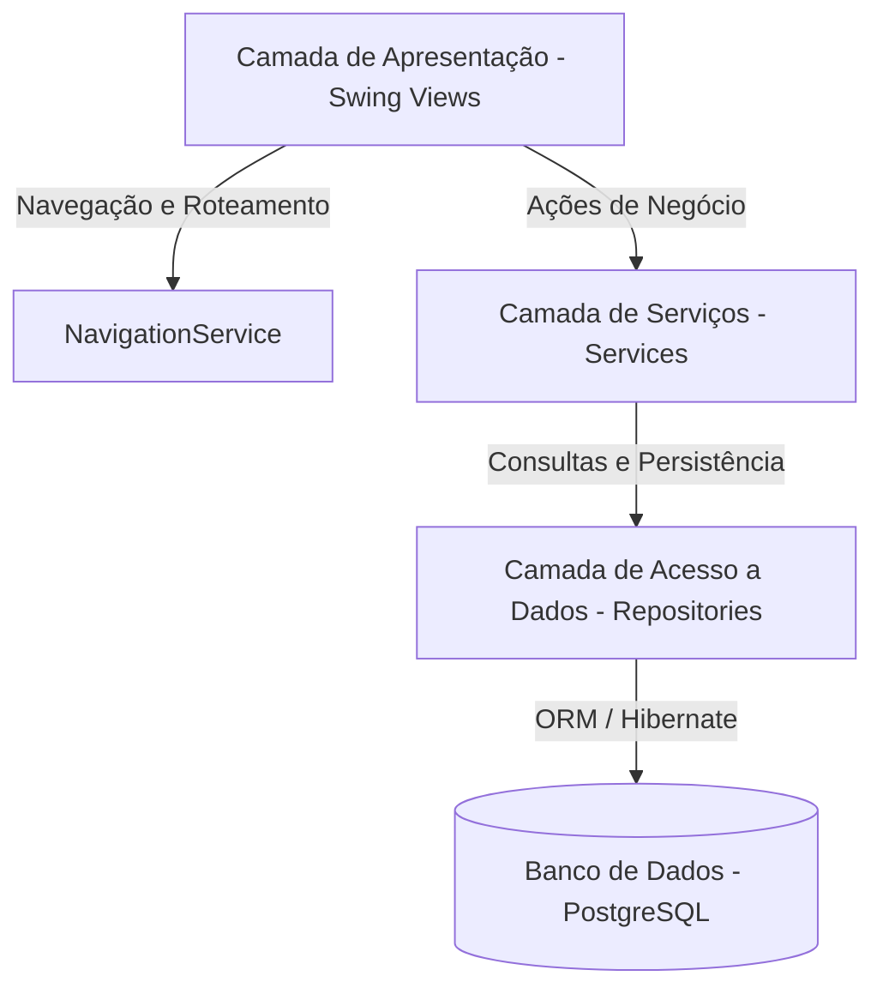

# 🏗️ Arquitetura do Sistema — Recanto do Sagrado Coração

Este documento descreve a organização arquitetural do sistema desktop desenvolvido para o Recanto do Sagrado Coração, detalhando as camadas, fluxo de controle e padrões de projeto adotados.

---

## 🏛️ Visão Geral

A aplicação segue uma arquitetura em camadas estruturada em cima do **Spring Boot 3.5.0**, mas adaptada para uma interface gráfica **Java Swing** rica. A separação de responsabilidades segue a divisão clássica:



---

## 📂 Camadas do Sistema

### 1. Camada de Apresentação (View)
- Localização: `com.ProjetoExtensao.Projeto.view`
- Responsável por renderizar a interface desktop baseada em Java Swing.
- Todas as telas estendem `JFrame` ou `JDialog` e são registradas como Spring Beans utilizando `@Component`.
- Utilizam a anotação `@PostConstruct` no método `initUI()` para construir e estruturar os componentes Swing após a injeção de dependências do Spring.

### 2. Camada de Navegação (NavigationService)
- Localização: `com.ProjetoExtensao.Projeto.servicos.NavigationService`
- Padrão Mediator/Roteador. Gerencia a abertura e fechamento de janelas para evitar o acoplamento direto de uma tela em outra.
- **Injeção Preguiçosa (`@Lazy`):** Todas as telas são injetadas com `@Lazy` para evitar ciclos de dependência circular na inicialização e otimizar o uso de memória.

### 3. Camada de Serviços (Services)
- Localização: `com.ProjetoExtensao.Projeto.servicos`
- Contém a lógica de negócios, validações, regras de cálculo e cruzamento de dados.
- Exemplos: cálculo de cobertura vacinal, triagem de incidentes, geração de históricos consolidados.

### 4. Camada de Persistência (Repositories)
- Localização: `com.ProjetoExtensao.Projeto.repositorios`
- Interfaces de acesso a dados que estendem `JpaRepository` do Spring Data JPA.
- Simplifica as consultas SQL e o CRUD básico de entidades, utilizando mapeamentos declarativos e métodos derivados de nomes.

### 5. Camada de Modelos (Models)
- Localização: `com.ProjetoExtensao.Projeto.models`
- Entidades ricas anotadas com JPA `@Entity` mapeadas para tabelas do PostgreSQL.
- Utilizam **Lombok** (`@Getter`, `@Setter`, `@NoArgsConstructor`, `@AllArgsConstructor`) para redução de código repetitivo (Boilerplate).

---

## 🎨 Infraestrutura Visual e Utilidades
- **`Cores.java`:** Centraliza a paleta de cores (tema escuro e claro harmoniosos) para garantir a integridade da identidade visual do sistema.
- **`PanelsFactory.java`:** Fábrica de componentes visuais comuns (Header institucional, Rodapé com relógio e botões globais como Sair, Atualizar e Voltar).
- **`IconManager.java`:** Gerencia o carregamento de imagens e ícones dimensionados automaticamente para a interface.

---

## ⚡ Tratamento de Dependência Circular (Lazy Loading)

Como as telas Swing necessitam referenciar o serviço de navegação e este precisa instanciar as telas, a injeção padrão causaria um estouro de pilha na inicialização. Para resolver isso:
1. O `NavigationService` é anotado como `@Service`.
2. As instâncias de `JFrame` são anotadas como `@Component`.
3. As injeções mútuas utilizam `@Lazy`:
   ```java
   @Autowired
   @Lazy
   private TelaPacientes telaPacientes;
   ```
Isso instrui o Spring a injetar um proxy leve na inicialização e carregar o bean real apenas quando a tela for de fato aberta.
